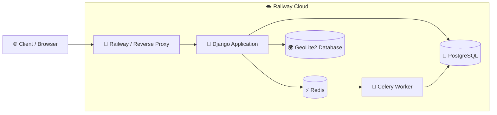

# Linkship 🚀

<div align="center">

[](https://python.org)
[](https://djangoproject.com)
[](https://postgresql.org)
[](https://redis.io)
[](https://docs.celeryq.dev)
[](https://docker.com)
[](https://railway.app)
[](#-testing)
[](LICENSE)

**A production-style URL shortening platform featuring analytics, QR code generation, JWT-secured APIs, and asynchronous click processing.**

[Live Demo](https://linkship-production.up.railway.app) · [API Docs](https://linkship-production.up.railway.app/api/docs/) · [Report Bug](https://github.com/Abitesh/Linkship/issues)

</div>

---

## 📘 Project Overview

Linkship is a full-stack URL shortening platform that focuses on **real-world engineering concerns** rather than just shortening links:

- **Asynchronous analytics** via Celery + Redis, so redirects stay fast even under load.
- **Deep click insights**: device, browser, country, city, and click timeline per link.
- **JWT-secured REST API** suitable for integration with frontends or mobile apps.
- **Production-style setup** with separate `local.py` and `production.py` settings, Docker, and Railway deployment.

This project exists to demonstrate:

- Ability to design a small but realistic backend system.
- Comfort with Django, DRF, Celery, Redis, PostgreSQL, and testing.
- Skills that matter in interviews (architecture, performance, testing, documentation).

---

## Why Linkship?

Most URL shorteners simply redirect users.

Linkship focuses on building the infrastructure around URL shortening:

- Fast redirects using Redis caching

- Background analytics processing with Celery

- JWT-secured REST APIs

- QR code generation

- Geolocation tracking

- Production-ready architecture

- Automated testing

---

## 📸 Preview

### Landing Page


### Dashboard


### Analytics


### Swagger API


---

## 📋 Table of Contents

- [Core Features](#-core-features)
- [System Architecture](#-system-architecture)
- [Tech Stack](#-tech-stack)
- [Folder Structure](#-folder-structure)
- [Local Setup](#-local-setup)
- [Docker Setup](#-docker-setup)
- [Environment Variables](#-environment-variables)
- [API Reference](#-api-reference)
- [Testing](#-testing)
- [Deployment](#-deployment)
- [Performance Highlights](#-performance-highlights)
- [Future Improvements](#-future-improvements)
- [Contributing](#-contributing)
- [Author](#-author)

---

## ✨ Core Features

| Feature | Description |
|---|---|
| 🔗 **Link Shortening** | Shorten any long URL with random short codes or custom aliases. |
| 📊 **Deep Analytics** | Track total clicks, per-day timeline, device type, browser, and location. |
| 🌍 **Geolocation Tracking** | Resolve IP addresses into country and city using GeoLite2. |
| 📷 **QR Code Generation** | Generate and download QR codes for every shortened link. |
| 👤 **User Accounts** | Register, login, and manage profile with a simple Bootstrap UI. |
| 🔐 **JWT API Auth** | Secure API access via JSON Web Tokens (`djangorestframework-simplejwt`). |
| ⚡ **Async Analytics** | Click enrichment (UA parsing, GeoIP, click_count) via Celery + Redis workers. |
| 🧊 **Caching** | URL resolution and analytics results cached via Redis to reduce DB load. |

---

## 📊 System Architecture



### Request Lifecycle

```text
Client
   │
   ▼
Railway Reverse Proxy
   │
   ▼
Django receives the request
   │
   ├── Look up short URL in Redis
   │
   ├── Fallback to PostgreSQL if cache misses
   │
   ├── Queue analytics task to Celery
   │
   └── Return HTTP 302 redirect immediately
                │
                ▼
         Celery Worker
                │
                ├── Parse User-Agent
                ├── GeoIP lookup
                ├── Store Click record
                └── Increment click_count
```

### Why this architecture?

- **Fast redirects:** The user is redirected immediately without waiting for analytics.
- **Asynchronous processing:** Celery handles device detection, browser parsing, and GeoIP enrichment in the background.
- **Caching:** Redis minimizes repeated database queries for frequently accessed links.
- **Scalability:** Django web servers and Celery workers can be scaled independently.
- **Production-ready design:** The architecture mirrors common backend patterns used in modern web applications.

---

## 🛠️ Tech Stack

| Layer | Technology |
|---|---|
| **Language** | Python 3.13 |
| **Backend Framework** | Django 6.0 |
| **API Framework** | Django REST Framework (DRF) |
| **Frontend** | Bootstrap 5, Crispy Forms (`crispy_bootstrap5`) |
| **Database** | PostgreSQL 16 (Production & Local), SQLite (Default development & testing) |
| **Cache** | Redis 7 (`django-redis`) |
| **Task Queue** | Celery 5 (`redis` as message broker & result backend) |
| **Authentication** | Django Session Authentication, JWT (`djangorestframework-simplejwt`) |
| **Geolocation** | MaxMind GeoLite2 City Database (`geoip2`) |
| **QR Code Generation** | `qrcode`, `Pillow` |
| **API Documentation** | `drf-spectacular` (Swagger UI & ReDoc) |
| **Testing** | Django Test Framework, Django REST Framework Test Client (11/11 Tests Passing) |
| **Deployment** | Railway, Docker, Docker Compose |

---

## 📁 Folder Structure

The actual project layout (matching the repository):

```text
Linkship/
├── analytics/              # Click model, analytics API, Celery tasks
│   ├── models.py
│   ├── serializers.py
│   ├── tasks.py
│   ├── utils.py
│   ├── tests.py
│   └── api_urls.py
├── config/
│   ├── celery.py           # Celery app configuration
│   ├── urls.py             # Root URLConf (HTML + API routes)
│   ├── asgi.py             # ASGI entrypoint
│   ├── wsgi.py             # WSGI entrypoint
│   └── settings/
│       ├── base.py         # Common settings for all environments
│       ├── local.py        # Local development (PostgreSQL, GeoLite path)
│       └── production.py   # Railway / production overrides
├── core/                   # Shared utilities and base configuration
├── geo/                    # GeoLite2 database directory (local dev)
├── links/                  # URL shortening logic, services, API & HTML views
│   ├── models.py
│   ├── services.py
│   ├── serializers.py
│   ├── qr_utils.py
│   ├── views.py            # Redirect, dashboard, QR, API viewsets
│   ├── tests.py
│   └── urls.py
├── users/                  # Authentication, profiles, avatars
│   ├── models.py
│   ├── forms.py
│   ├── serializers.py
│   ├── views.py
│   ├── signals.py
│   ├── tests.py
│   └── urls.py
├── templates/
│   ├── base.html
│   ├── users/
│   │   ├── register.html
│   │   ├── login.html
│   │   └── profile.html
│   └── links/              # Landing / dashboard templates
├── docker-compose.yml
├── Dockerfile
├── Procfile                # Railway process config
├── manage.py
└── requirements.txt
```

Note: older `dev.py` / `prod.py` settings names have been replaced with `local.py` and `production.py` for clarity.

---

## 💻 Local Setup

### Prerequisites

- Python 3.13+
- PostgreSQL 16 (for `local.py`) or use default SQLite (fast start).
- Redis 7 running locally (or via Docker).

### Steps

**1. Clone the repository**

```bash
git clone https://github.com/Abitesh/Linkship.git
cd Linkship
```

**2. Create and activate a virtual environment**

```bash
python -m venv venv
source venv/bin/activate       # macOS / Linux
# venv\Scripts\activate       # Windows
```

**3. Install dependencies**

```bash
pip install -r requirements.txt
```

**4. Choose settings module**

For local development with PostgreSQL:

```bash
export DJANGO_SETTINGS_MODULE=config.settings.local  # macOS/Linux
# set DJANGO_SETTINGS_MODULE=config.settings.local  # Windows (PowerShell/CMD)
```

If you just want a quick run using SQLite:

```bash
export DJANGO_SETTINGS_MODULE=config.settings.base
```

**5. Run migrations and start the server**

```bash
python manage.py migrate
python manage.py createsuperuser   # optional, for admin access
python manage.py runserver
```

App will be available at `http://127.0.0.1:8000`.

**6. Start Redis and Celery worker**

Redis (if not already running):

```bash
redis-server
```

Celery worker (in a new terminal):

```bash
export DJANGO_SETTINGS_MODULE=config.settings.local
celery -A config.celery.app worker --loglevel=info
```

> Make sure `CELERY_BROKER_URL` and `CELERY_RESULT_BACKEND` are correctly set in your settings.

---

## 🐳 Docker Setup

You can spin up Django, PostgreSQL, Redis, and Celery with one command using Docker Compose:

```bash
docker-compose up --build
```

This will:

- Build the web image using `Dockerfile`.
- Start PostgreSQL and Redis containers.
- Start the Celery worker.

The web app will be available at `http://localhost:8000`.

To stop services:

```bash
docker-compose down
```

---

## 🔑 Environment Variables

Create a `.env` file (or export env vars) with values matching your environment:

```env
# Django core
SECRET_KEY=your-django-secret-key
DEBUG=True
ALLOWED_HOSTS=localhost,127.0.0.1

# Database (for local.py)
DB_NAME=your_database_name
DB_USER=your_database_user
DB_PASSWORD=your_database_password
DB_HOST=localhost
DB_PORT=5432

# Redis / Celery
REDIS_URL=redis://127.0.0.1:6379/1
CELERY_BROKER_URL=redis://127.0.0.1:6379/0
CELERY_RESULT_BACKEND=redis://127.0.0.1:6379/0

# GeoLite2 (local path)
GEOIP2_DB_PATH=/absolute/path/to/geo/GeoLite2-City.mmdb

# Short URL base
SHORT_BASE_URL=http://127.0.0.1:8000
```

> `.env` is ignored by Git and should never be committed.

---

## 📖 API Reference

Interactive documentation is provided via `drf-spectacular`.

| Endpoint | Description |
|---|---|
| `GET /api/docs/` | Swagger UI (OpenAPI) |
| `GET /api/redoc/` | ReDoc UI |
| `GET /api/schema/` | Raw OpenAPI 3.0 schema (JSON) |

### Auth & Users

| Method | Endpoint | Description |
|---|---|---|
| `POST` | `/api/auth/jwt/login/` | Obtain JWT access token (and optionally refresh). |
| `POST` | `/api/auth/jwt/refresh/` | Refresh access token. |
| `GET`  | `/api/users/me/` | Get current user profile. |

### Links

| Method | Endpoint | Description |
|---|---|---|
| `POST` | `/api/links/urls/` | Create a shortened URL (random or custom alias). |
| `GET`  | `/api/links/urls/` | List all links for the authenticated user. |
| `GET`  | `/api/links/urls/{id}/` | Retrieve details for a single link. |
| `PATCH`| `/api/links/urls/{id}/` | Update metadata (e.g., expiry). |
| `DELETE`| `/api/links/urls/{id}/` | Delete a link. |

### Redirect & QR

| Method | Endpoint | Description |
|---|---|---|
| `GET` | `/{short_code_or_alias}/` | Public redirect endpoint (302 to `original_url`). |
| `GET` | `/api/links/urls/{id}/qr/` | Download QR code PNG for the link. |

### Analytics

| Method | Endpoint | Description |
|---|---|---|
| `GET` | `/api/links/urls/{id}/analytics/` | Aggregated analytics for a link (total clicks, by day, top countries/devices/browsers). |

For full details, run the app and visit `http://127.0.0.1:8000/api/docs/`.

---

## 🧪 Testing

This project ships with automated tests for core functionality:

- Redirect flow and cache behavior.
- Link services (creation, custom alias validation, QR generation).
- JWT authentication and protected API access.
- Celery click recording task (enrichment and `click_count` increment).
- Users endpoints and basic profile behavior.

Run all tests with:

```bash
python manage.py test
```

On the current codebase, **11/11 tests pass**, which is highlighted in the README badges.

---

## 🚀 Deployment

The project is deployed to **Railway** using:

- `config/settings/production.py` for environment-specific settings.
- `Procfile` to define the web and worker processes.
- PostgreSQL and Redis provided by Railway or external services.

Deployment steps (high level):

1. Create a new Railway Django app.
2. Set `DJANGO_SETTINGS_MODULE=config.settings.production`.
3. Configure environment variables for DB, Redis, and GeoLite2.
4. Deploy from GitHub and run `python manage.py migrate`.
5. Ensure a Celery worker process is configured in Railway.

---

## ⚡ Performance Highlights

- Redirect path is intentionally **minimal**:
  - Cache lookup → DB fallback → Celery task enqueue → 302 response.
  - No heavy analytics logic in the request lifecycle.
- Analytics pipeline is fully asynchronous:
  - User-Agent parsing and GeoIP resolution happen in the Celery worker.
  - `click_count` is incremented atomically in the worker using `F()` updates.
- Redis-based caching reduces repeated database hits for popular links and analytics dashboards.

These choices mimic real-world production patterns and are easy to discuss in interviews.

---

## 🔮 Future Improvements

- WebSocket-based live analytics dashboard using Django Channels.
- Per-user rate limiting on link creation.
- Bulk link import and export.
- Custom domains and vanity URLs.
- Admin tooling for abuse detection (e.g., spam links).

---

## 🤝 Contributing

Contributions, issues and feature requests are welcome.

1. Fork the repository.
2. Create a feature branch: `git checkout -b feat/your-feature`.
3. Commit your changes: `git commit -m 'feat: add your feature'`.
4. Push to the branch: `git push origin feat/your-feature`.
5. Open a Pull Request.

---

## 👤 Author

**Abitesh** · [GitHub](https://github.com/Abitesh)

If you are a recruiter and want a quick walkthrough of the architecture or code, feel free to open an issue or reach out.

---

<div align="center">
⭐ If you found this project useful, consider giving it a star!
</div>
